# NotePad Android期中实验项目

### 软件工程2班 林鸣晨  121052022075

本项目是一个改进版的 Android NotePad 应用，扩展了以下功能：

1. **时间戳功能**：记录并显示笔记的创建时间和最后修改时间。
2. **查询功能**：支持通过标题或内容关键词实时搜索笔记。
3. **背景更换功能**：支持动态更换主界面的背景图片。
4. **搜索栏字体颜色动态更换功能**：允许用户通过按钮更改搜索栏输入字体颜色。

------

## 功能实现效果图

## 界面示例

### 功能一：时间戳

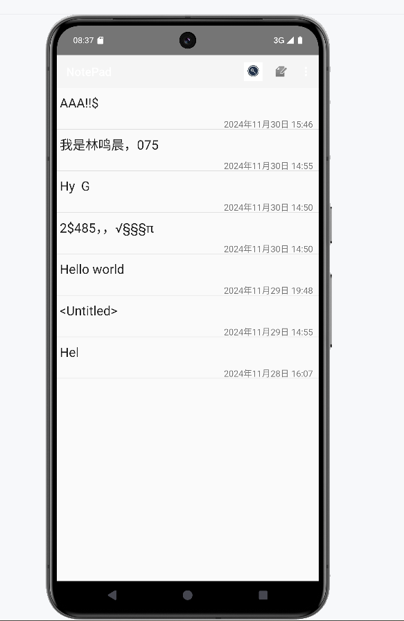

## 功能二：查询

通过点击菜单栏上的查询图标进行查询


#### 可以进行根据标题或者内容进行查询。即使有的标题不含被查字段但内容含有也可被查到

如title为“我是林鸣晨，075”，但其中内容也含有“Hello”：

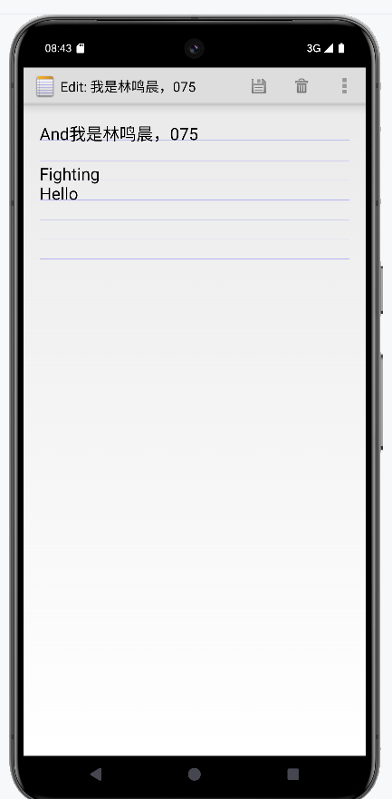

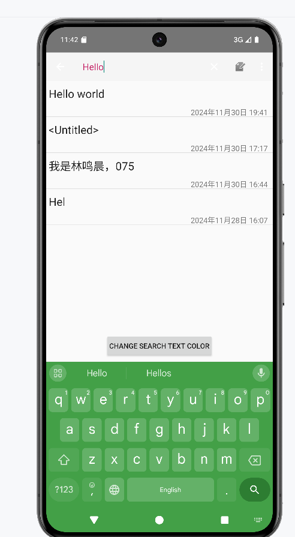

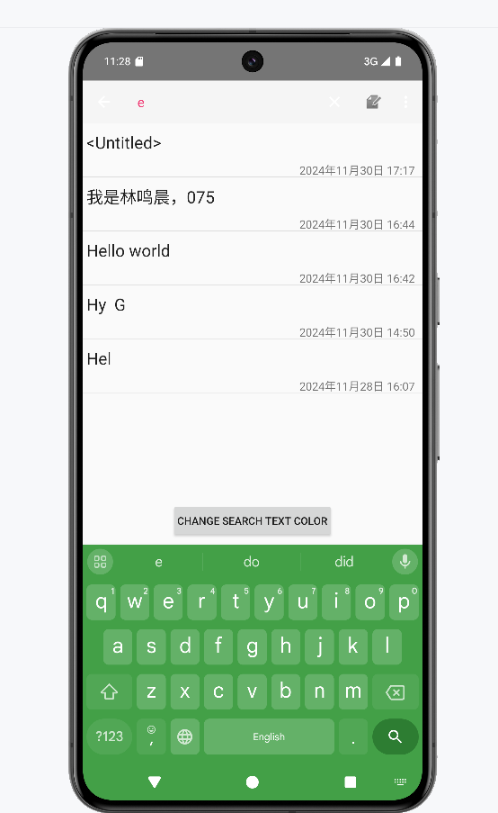

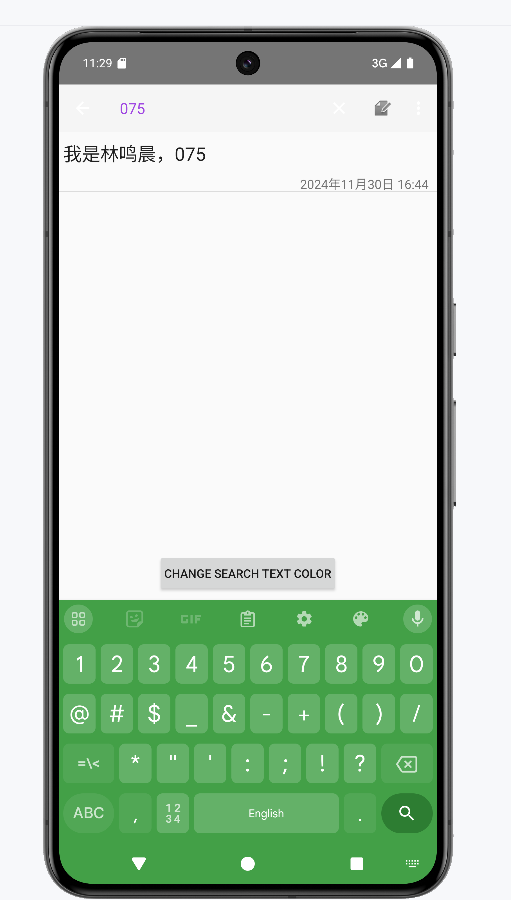

## 附加功能------功能三：切换背景

#### 初始效果


### 点击右上角“更多选项”，点击“Change Background”

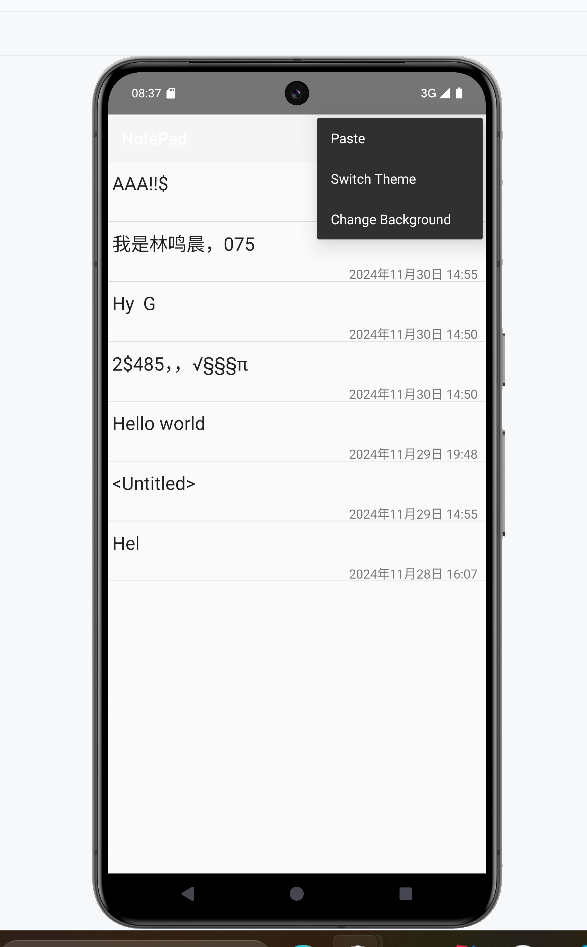

#### 出现两种选项

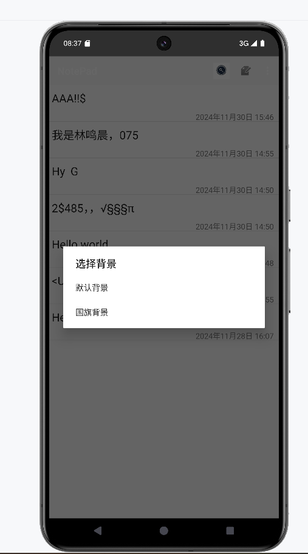

### 选择默认背景时，显示出：

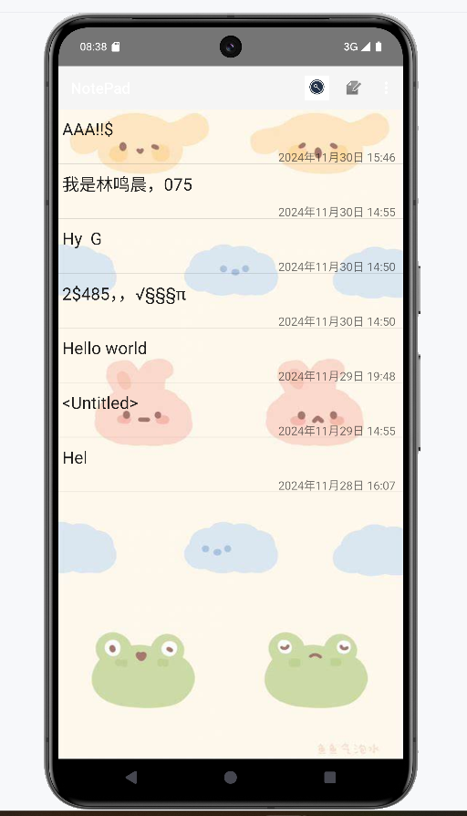

### 选择国旗背景时，显示：


## 附加功能-------功能四：切换搜索栏字体颜色

#### 通过点击键盘上方的“CHANGE SEARCH TEXT COLOR”这个按钮，来实现搜索栏字体颜色的随机切换

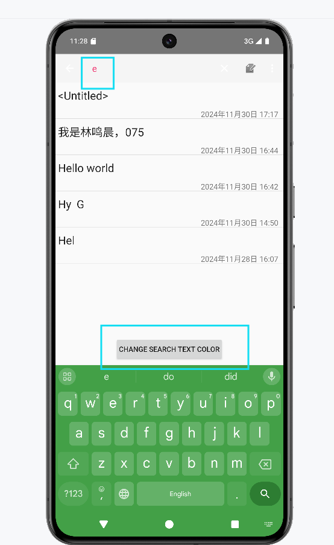

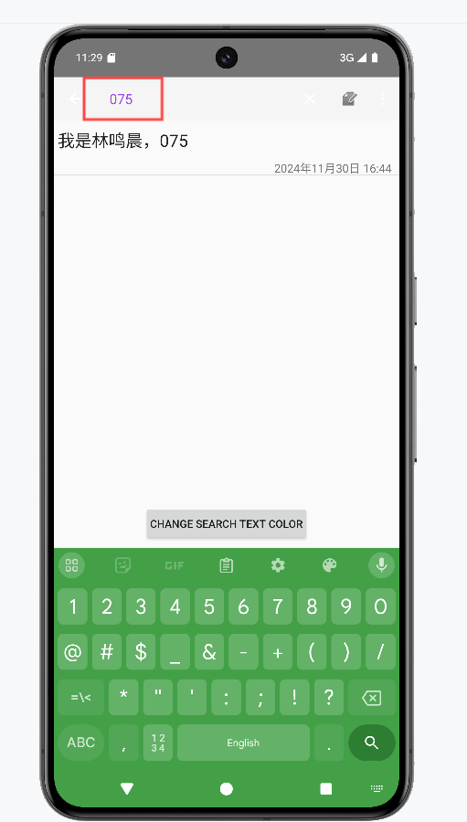

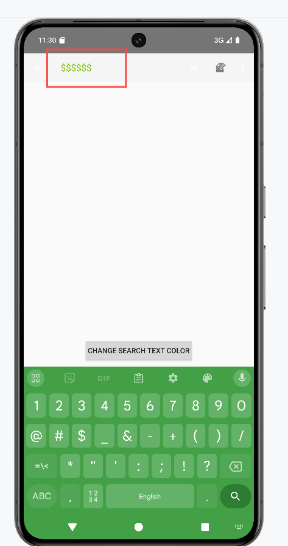

### 点击“SWITCH THEME",即可切换为初始的背景


## 功能实现详细说明

### 1. 时间戳功能

**功能描述**：

- 每条笔记在创建时记录其创建时间，并在修改时更新其修改时间。
- 在笔记列表中，显示笔记的最后修改时间，以人类可读的日期格式呈现。

**实现细节**：

#### 1.1 契约类 `NotePad`

契约类定义了数据库表的结构及 URI，与内容提供者和客户端交互：

```
public final class NotePad {
    public static final class Notes implements BaseColumns {
        public static final String TABLE_NAME = "notes";
        public static final String COLUMN_NAME_TITLE = "title"; // 标题
        public static final String COLUMN_NAME_NOTE = "note"; // 笔记内容
        public static final String COLUMN_NAME_CREATE_DATE = "created"; // 创建时间
        public static final String COLUMN_NAME_MODIFICATION_DATE = "modified"; // 修改时间
        public static final Uri CONTENT_URI = Uri.parse("content://com.google.provider.NotePad/notes");
    }
}
```

#### 1.2 数据库管理 `NotePadProvider`

在 `NotePadProvider` 的 `insert` 和 `update` 方法中，自动记录笔记的时间戳：

```
@Override
public Uri insert(Uri uri, ContentValues values) {
    Long now = System.currentTimeMillis();
    if (!values.containsKey(NotePad.Notes.COLUMN_NAME_CREATE_DATE)) {
        values.put(NotePad.Notes.COLUMN_NAME_CREATE_DATE, now);
    }
    if (!values.containsKey(NotePad.Notes.COLUMN_NAME_MODIFICATION_DATE)) {
        values.put(NotePad.Notes.COLUMN_NAME_MODIFICATION_DATE, now);
    }
    long rowId = db.insert(NotePad.Notes.TABLE_NAME, null, values);
    return ContentUris.withAppendedId(NotePad.Notes.CONTENT_URI, rowId);
}

@Override
public int update(Uri uri, ContentValues values, String selection, String[] selectionArgs) {
    values.put(NotePad.Notes.COLUMN_NAME_MODIFICATION_DATE, System.currentTimeMillis());
    return db.update(NotePad.Notes.TABLE_NAME, values, selection, selectionArgs);
}
```

#### 1.3 时间格式化工具 `DateDisplay`

通过自定义工具类格式化时间戳：

```
public class DateDisplay {
    private static final SimpleDateFormat DATE_FORMAT = new SimpleDateFormat("yyyy年MM月dd日 HH:mm", Locale.getDefault());
    static { DATE_FORMAT.setTimeZone(TimeZone.getTimeZone("GMT+8")); }

    public static String showTime(Long time) {
        return time == null ? "" : DATE_FORMAT.format(new Date(time));
    }
}
```


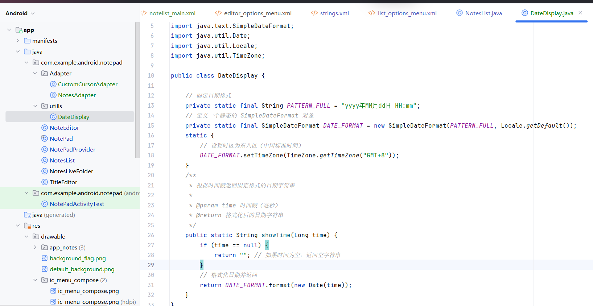


#### 1.4 显示时间戳：`NotesList` 的适配器

在 `NotesList` 中，使用 `ViewBinder` 处理时间戳格式化显示：

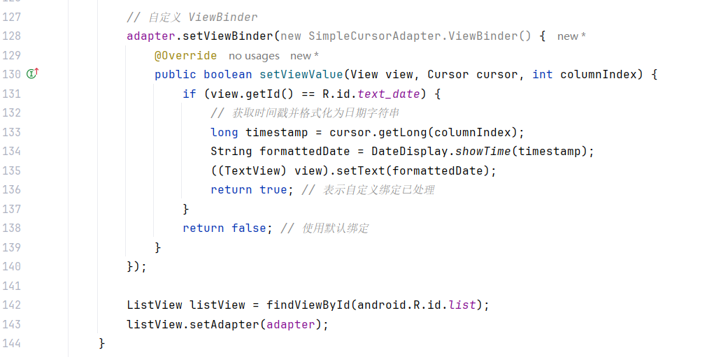

```
adapter.setViewBinder((view, cursor, columnIndex) -> {
    if (view.getId() == R.id.text_date) {
        long timestamp = cursor.getLong(columnIndex);
        ((TextView) view).setText(DateDisplay.showTime(timestamp));
        return true;
    }
    return false;
});
```

------

### 2. 查询功能

**功能描述**：

- 用户通过搜索栏输入关键词，实时查询笔记标题和内容，显示匹配的结果。

**实现细节**：

#### 2.1 `SearchView` 的配置

在 `NotesList` 中配置 `SearchView`，实现实时查询：

```
@Override
public boolean onCreateOptionsMenu(Menu menu) {
    MenuInflater inflater = getMenuInflater();
    inflater.inflate(R.menu.list_options_menu, menu);

    MenuItem searchItem = menu.findItem(R.id.menu_search);
    SearchView searchView = (SearchView) searchItem.getActionView();
    searchView.setQueryHint("Search Notes");

    searchView.setOnQueryTextListener(new SearchView.OnQueryTextListener() {
        @Override
        public boolean onQueryTextSubmit(String query) {
            performSearch(query);
            return true;
        }

        @Override
        public boolean onQueryTextChange(String newText) {
            performSearch(newText);
            return true;
        }
    });

    return super.onCreateOptionsMenu(menu);
}
```

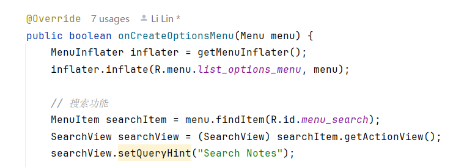

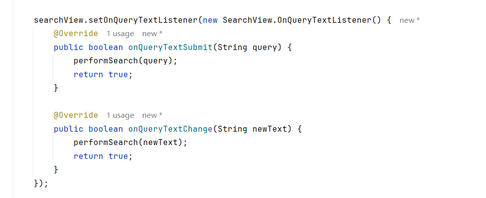

#### 2.2 查询方法实现

`performSearch` 实现模糊查询：

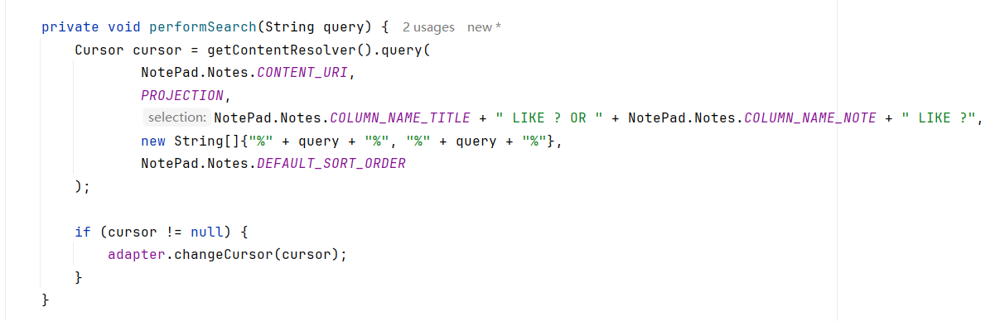

```
private void performSearch(String query) {
    Cursor cursor = getContentResolver().query(
        NotePad.Notes.CONTENT_URI,
        PROJECTION,
        NotePad.Notes.COLUMN_NAME_TITLE + " LIKE ? OR " + NotePad.Notes.COLUMN_NAME_NOTE + " LIKE ?",
        new String[]{"%" + query + "%", "%" + query + "%"},
        NotePad.Notes.DEFAULT_SORT_ORDER
    );

    if (cursor != null) {
        adapter.changeCursor(cursor);
    }
}
```

------

### 3. 背景更换功能

**功能描述**：

- 用户通过菜单选择背景图片，动态切换主界面的背景。

**实现细节**：

#### 3.1 定义背景切换方法

`showBackgroundOptions` 显示背景选择对话框：

```
private void showBackgroundOptions() {
    String[] options = {"默认背景", "国旗背景"};
    int[] backgroundResources = {R.drawable.default_background, R.drawable.background_flag};

    new AlertDialog.Builder(this)
        .setTitle("选择背景")
        .setItems(options, (dialog, which) -> {
            LinearLayout mainLayout = findViewById(R.id.main_layout);
            mainLayout.setBackgroundResource(backgroundResources[which]);
        })
        .show();
}
```

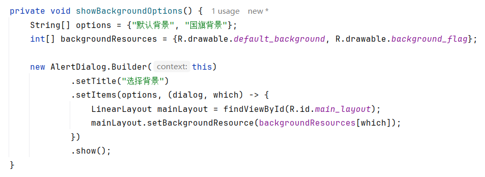

#### 3.2toolbar

`Toolbar` 位于主界面顶部，统一管理各功能入口（如查询、主题切换、背景更换等）。

#### 实现细节

**布局中的 `Toolbar`**：

```
<androidx.appcompat.widget.Toolbar
    android:id="@+id/toolbar"
    android:layout_width="match_parent"
    android:layout_height="?attr/actionBarSize"
    android:background="?attr/colorPrimary"
    android:theme="@style/ThemeOverlay.AppCompat.Dark.ActionBar"
    app:title="NotePad"
    app:titleTextColor="@android:color/white" />
```

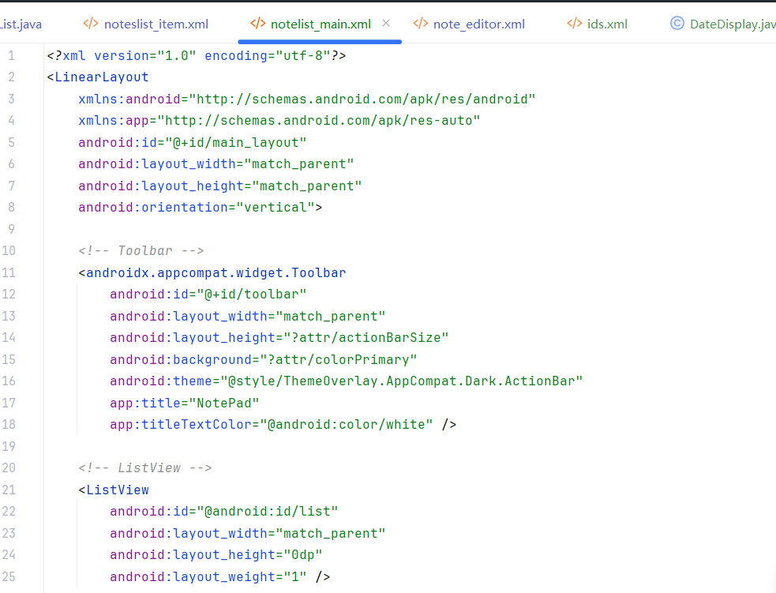

**绑定 `Toolbar`**：

```
Toolbar toolbar = findViewById(R.id.toolbar);
setSupportActionBar(toolbar);
```

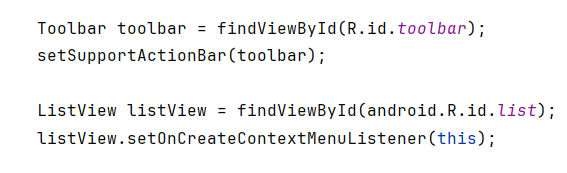

**功能入口菜单**： 通过 `onCreateOptionsMenu` 方法，绑定查询、背景更换、主题切换等功能到 `Toolbar` 的菜单中：

```
Override
public boolean onCreateOptionsMenu(Menu menu) {
    MenuInflater inflater = getMenuInflater();
    inflater.inflate(R.menu.list_options_menu, menu);
    return super.onCreateOptionsMenu(menu);
}
```

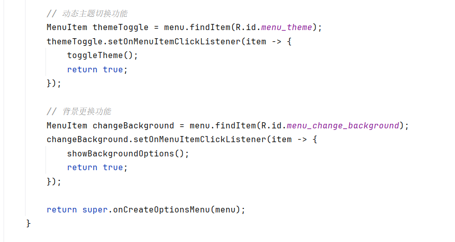


#### 3.3 菜单绑定功能

将背景切换功能绑定到菜单：

 MenuItem changeBackground = menu.findItem(R.id.menu_change_background);changeBackground.setOnMenuItemClickListener(item -> {    showBackgroundOptions();    return true;});

#### 3.4设置布局xml文件

###### 创建notelist_main.xml来确定背景进行切换

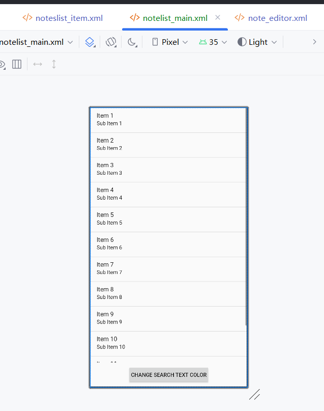

##### 再在list_options_menu.xml添加切换背景的组件

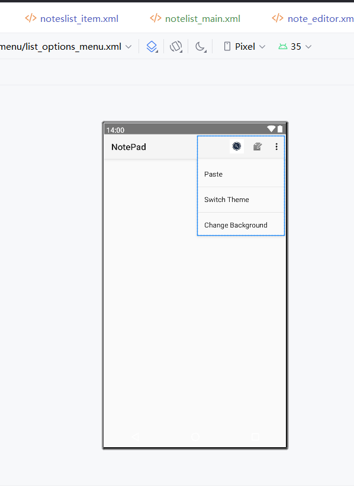

##### 在res/drawble包下放入两张背景的图片，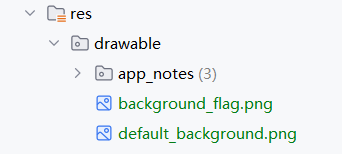

#### 两张背景


```
MenuItem changeBackground = menu.findItem(R.id.menu_change_background);
changeBackground.setOnMenuItemClickListener(item -> {
    showBackgroundOptions();dd
    return true;rn true;rn true;rn true;rn true;rn true;rn true;
});
```

------

### 4. 搜索栏字体颜色动态更换功能

**功能描述**：

- 用户可以通过按钮动态调整搜索栏输入框文字的颜色。

**实现细节**：

#### 4.1 搜索栏颜色更新方法

`updateSearchViewColor` 动态设置搜索栏文字颜色：


```
private void updateSearchViewColor(SearchView searchView) {
    EditText searchEditText = searchView.findViewById(androidx.appcompat.R.id.search_src_text);
    if (searchEditText != null) {
        searchEditText.setTextColor(currentSearchTextColor); // 动态颜色
        searchEditText.setHintTextColor(getResources().getColor(R.color.search_hint_color));
    }
}
```

#### 4.2 颜色切换逻辑

添加按钮用于动态修改搜索栏文字颜色，通过random函数随机获取颜色：

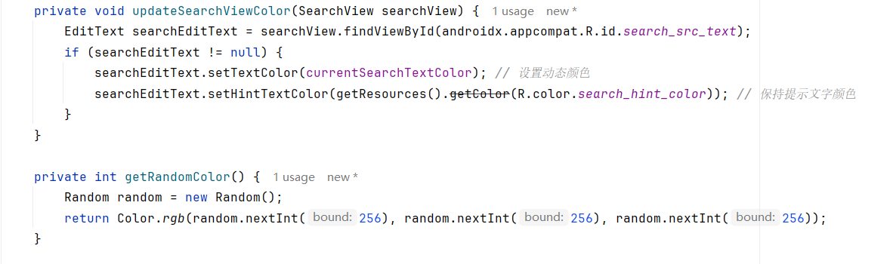

```
Button changeColorButton = findViewById(R.id.change_color_button);
changeColorButton.setOnClickListener(v -> {
    currentSearchTextColor = getRandomColor(); // 随机颜色
    updateSearchViewColor();
});

private int getRandomColor() {
    Random random = new Random();
    return Color.rgb(random.nextInt(256), random.nextInt(256), random.nextInt(256));
}
```

#### 4.3 搜索栏动态颜色初始化

在 `onCreateOptionsMenu` 方法中调用颜色更新：

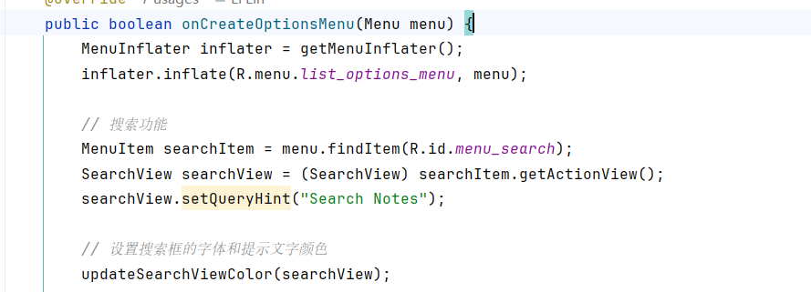

```
MenuItem searchItem = menu.findItem(R.id.menu_search);
SearchView searchView = (SearchView) searchItem.getActionView();
updateSearchViewColor(searchView);
```

------

## 

#### 项目结构

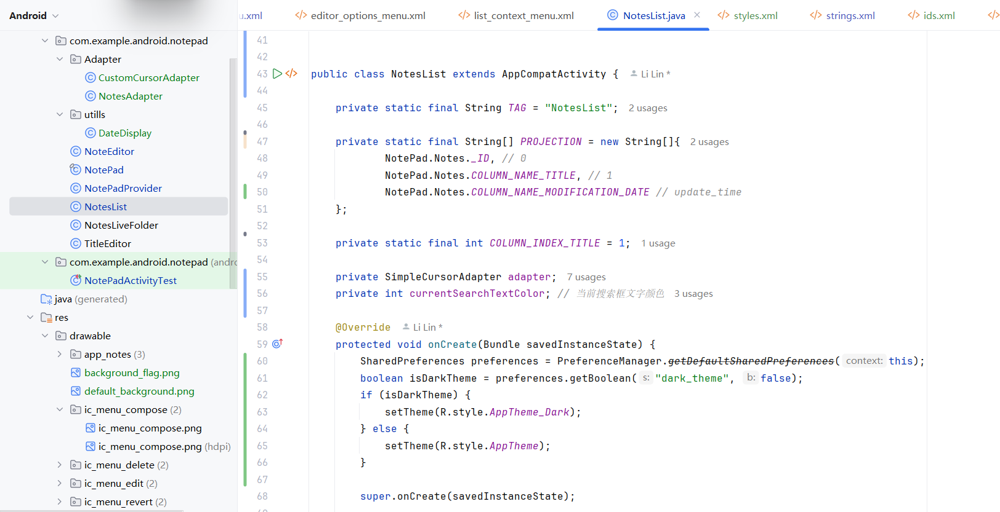

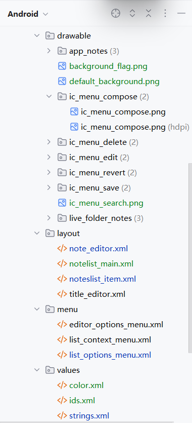

### 1. 主界面

- 显示笔记列表，包含标题和格式化后的时间戳。

### 2. 查询功能

- 用户输入关键词后，界面实时显示匹配的结果。

### 3. 背景更换

- 用户选择不同的背景样式后，界面背景即时更新。

### 4. 搜索栏字体颜色动态更换

- 按钮更改搜索栏输入字体颜色，效果即时生效。

------

## 总结

该实验通过契约类和内容提供者实现了时间戳记录与更新，利用 `SearchView` 和 `CursorAdapter` 实现了高效的查询功能，并通过动态 UI 更新技术增强了用户体验。完整代码已测试，功能运行稳定。
